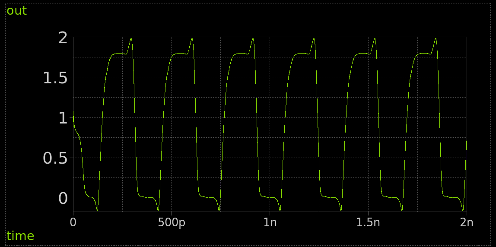

 

* [3D viewer](https://gds-viewer.tinytapeout.com/?model=https://raw.githubusercontent.com/mattvenn/tt08-ring-oscillator/main/gds/ring_osc.gds.gltf)
* [STL files](./stl) created with [GDSiiSTL](https://github.com/mbalestrini/gdsiistl)
* [Schematic](https://xschem-viewer.com/?file=https%3A%2F%2Fgithub.com%2Fmattvenn%2Ftt08-ring-oscillator%2Fblob%2Fmain%2Fxschem%2Fring_osc.sch)
* [Simulation output](./xschem/simulation/ring_osc.raw)
* [Sky130 PDK stackup dimensions](https://www.zerotoasiccourse.com/terminology/pdk/)

# Tiny Tapeout Analog Project Template

- [Read the documentation for project](docs/info.md)

## What is Tiny Tapeout?

Tiny Tapeout is an educational project that aims to make it easier and cheaper than ever to get your digital designs manufactured on a real chip.

To learn more and get started, visit https://tinytapeout.com.

## Analog projects

For specifications and instructions, see the [analog specs page](https://tinytapeout.com/specs/analog/).

## Enable GitHub actions to build the results page

- [Enabling GitHub Pages](https://tinytapeout.com/faq/#my-github-action-is-failing-on-the-pages-part)

## Resources

- [FAQ](https://tinytapeout.com/faq/)
- [Digital design lessons](https://tinytapeout.com/digital_design/)
- [Learn how semiconductors work](https://tinytapeout.com/siliwiz/)
- [Join the community](https://tinytapeout.com/discord)

## What next?

- [Submit your design to the next shuttle](https://app.tinytapeout.com/).
- Edit [this README](README.md) and explain your design, how it works, and how to test it.
- Share your project on your social network of choice:
  - LinkedIn [#tinytapeout](https://www.linkedin.com/search/results/content/?keywords=%23tinytapeout) [@TinyTapeout](https://www.linkedin.com/company/100708654/)
  - Mastodon [#tinytapeout](https://chaos.social/tags/tinytapeout) [@matthewvenn](https://chaos.social/@matthewvenn)
  - X (formerly Twitter) [#tinytapeout](https://twitter.com/hashtag/tinytapeout) [@matthewvenn](https://twitter.com/matthewvenn)
